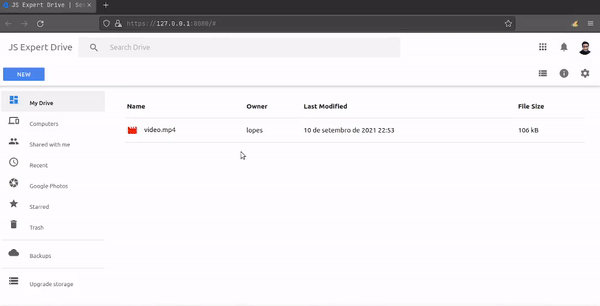

<h3 align="center">
  
</h3>

<br>

<p align="center">
   
  
  <a href="https://github.com/savio-2-lopes">
    
  </a>
</p>

<br> 

## :pushpin: Índice

- [Sobre](#sobre-o-projeto)
- [Créditos de Layout](#creditos)
- [Deploy](#deploy)
- [Layout](#layout)
- [Como Executar](#executar)
- [Tecnologias](#tecnologias)
- [Agradecimentos](#agradecimentos)
- [Autor](#autor)

<br>

<a id="sobre-o-projeto"></a>

## 💻 Sobre o projeto

🚀  Clone do Google Drive, desenvolvido durante a [5º Semana Javascript Expert](https://javascriptexpert.com.br), ministrada por [Erick Wendel](https://github.com/ErickWendel)

<br>

<a id="creditos"></a>

## :memo: Créditos ao Layout 

O Layout foi adaptado a partir do projeto de [Leonardo Santo](https://github.com/leoespsanto) disponibilizado no [codepen](https://codepen.io/leoespsanto/pen/KZMMKG). 

<br>

<a id="deploy"></a>

## :zap: Deploy 

O deploy da aplicação está disponível por este [link](#). 

<br>

<a id="layout"></a>

## 🎨 Layout

<p align="center"> 
  
</p>
 
<br>

<a id="executar"></a>

## 🚀 Como executar o projeto

### Pré-requisitos

Antes de começar, você vai precisar ter instalado em sua máquina as seguintes ferramentas:
[Git](https://git-scm.com), [Node.js](https://nodejs.org/en/) e o gerenciador de pacotes [Yarn](https://yarnpkg.com).
Além disto é bom ter um editor para trabalhar com o código como [VSCode](https://code.visualstudio.com/)

<br>

#### 🧭 Rodando a aplicação

```bash

# Clone este repositório
$ git clone https://github.com/savio-2-lopes/semana-javascript-expert05.git

# Acesse a aula 3 (completa)
$ cd semana-javascript-expert05/aulas/aula3

# Instale as depedências e execute o backend
$ cd gdrive-webapi 
$ yarn
$ yarn start

# Saia da pasta do backend, instale as depedências e execute o Frontend
$ cd ..
$ cd gdrive-webapp  
$ yarn
$ yarn dev

# A tela será aberta em seu navegador

```

<br>

<a id="tecnologias"></a>

## 🛠 Tecnologias

As seguintes ferramentas foram usadas na construção do projeto:

- [NodeJS](https://nodejs.org/en/)

<br>

## 💜 Agradecimentos

A aplicação foi desenvolvida durante a [5º Semana Javascript Expert](https://javascriptexpert.com.br), ministrada por [Erick Wendel](https://github.com/ErickWendel). Todos meus agradecimentos a [Erick Wendel](https://github.com/ErickWendel) por disponibilizar este contéudo sensacional.

<br>

<a id="autor"></a>

## 🦸 Autor

[](https://github.com/savio-2-lopes) 
[](https://www.instagram.com/savioaugulopes/) 
[](https://www.linkedin.com/in/savio-lopes/) 
[](mailto:savio.dev.lopes@gmail.com) 

Desenvolvido por Savio Lopes 👋🏽 [Entre em contato!](https://www.linkedin.com/in/savio-lopes/)